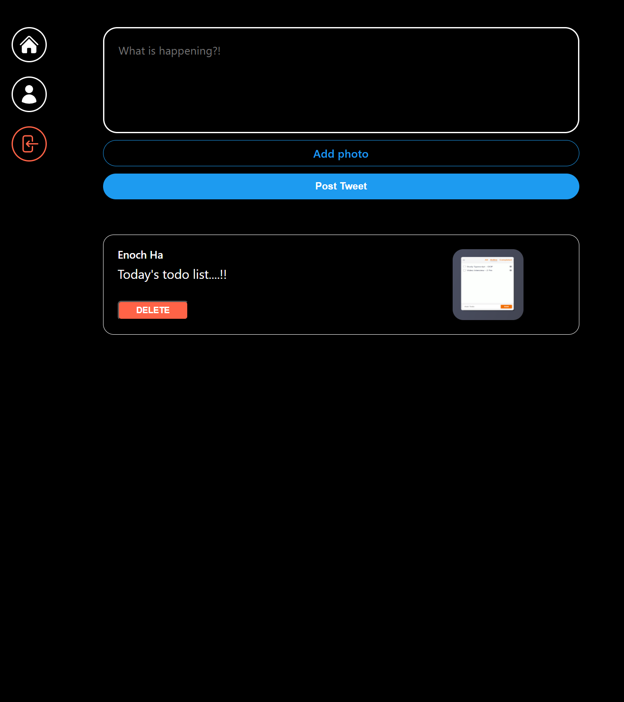
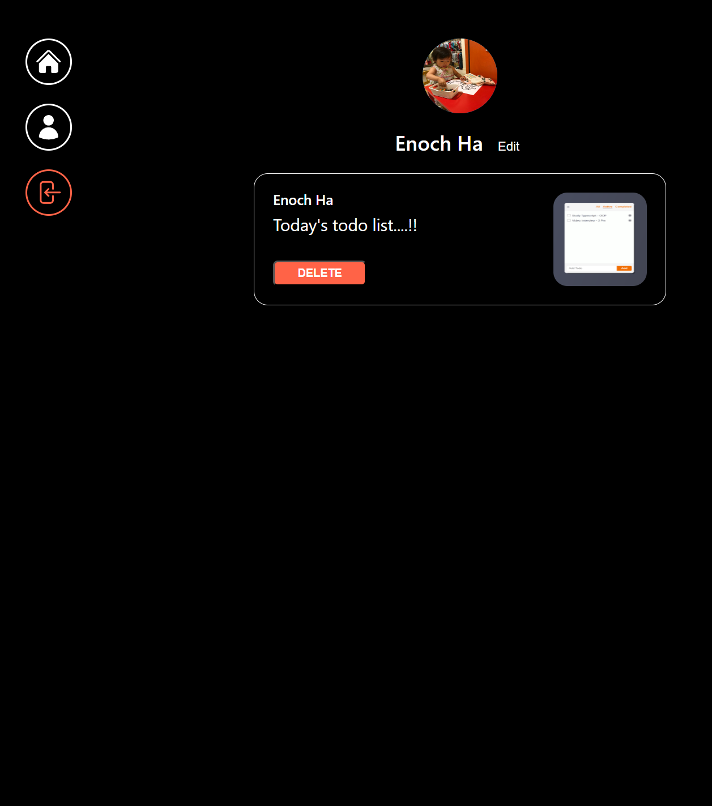
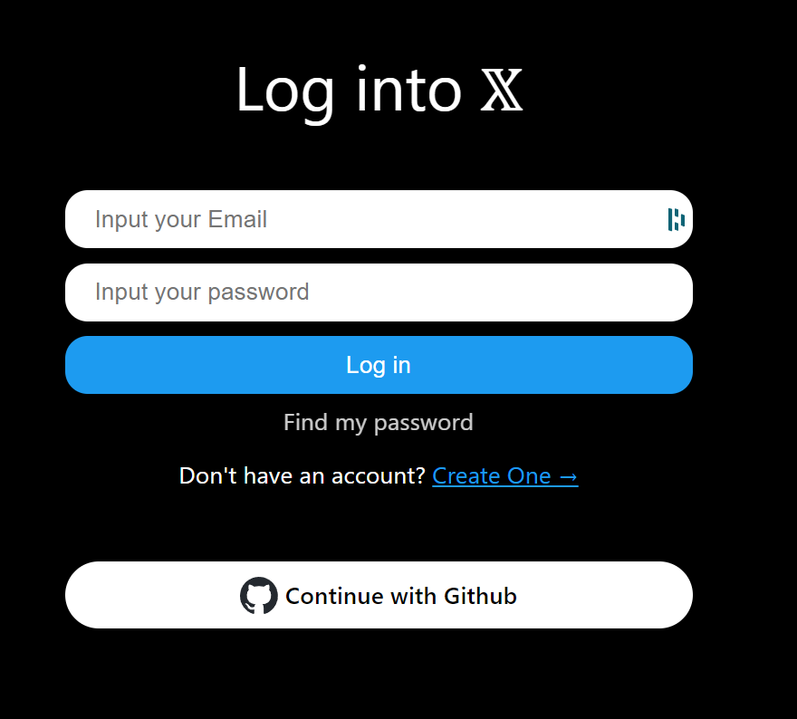

# Twitter Clone Web Application

This project is a Twitter clone web application implemented using React, TypeScript, Vite, styled Components, and Firebase. Users can write and publish tweets, as well as view tweets from other users.

### Time-line page:

### Account page:

### Login page

---
